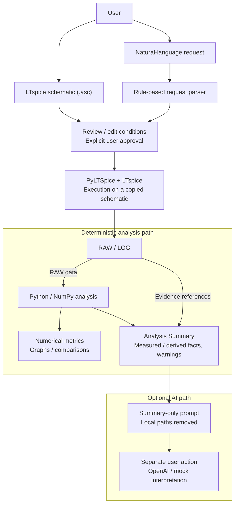

# Circuit Simulation Assistant

Turns natural-language simulation requests into reviewed LTspice runs, deterministic numerical analysis, and optional AI interpretation.

아날로그·혼합신호 회로를 학습하거나 실험하는 사용자를 위한 Windows / Streamlit 도구입니다. 사용자가 작성한 `.asc` 회로와 자연어 요청을 입력하면 조건을 구조화하고, **사용자의 검토·수정·명시적 승인 후** 실행용 복사본을 LTspice로 시뮬레이션합니다. Gain·bandwidth·Vpp 등의 정량값은 **Python / NumPy가 계산**하며, 선택 AI 해석은 이미 계산된 Analysis Summary를 설명하는 별도 단계입니다.

**Latest release: [v0.1.1](https://github.com/minsu727/circuit-simulation-assistant/releases/tag/v0.1.1)** · [Windows installer 다운로드](https://github.com/minsu727/circuit-simulation-assistant/releases/download/v0.1.1/CircuitSimulationAssistant-Setup.exe). 설치 요구사항과 미검증 범위는 [Windows Release](#windows-release)를 확인하세요.

## Why I Built It

전자회로 실험에서 directive 문법 확인, waveform 수동 측정, 소자 값 변경에 따른 반복 시뮬레이션, 결과 비교와 보고서 정리에 드는 시간을 줄이고 싶었습니다.

처음에는 임의의 회로를 자동 생성하는 방식도 고려했습니다. current mirror와 feedback 같은 topology의 복잡성을 고려해, **v1에서는 schematic 작성은 사용자에게 맡기고 시뮬레이션·분석 자동화에 집중**하도록 범위를 줄였습니다. [문제 정의](problem-definition.md)와 [SPEC](SPEC.md)에 이 결정과 장기 계획을 기록했습니다. SPEC의 목표 기능이 모두 구현된 것은 아닙니다.

## Workflow

```text
Natural-language Request
  → Review / Edit
  → User Approval
  → LTspice (execution copy)
  → Deterministic Python Analysis
  → Comparison / Analysis Summary
  → AI Interpretation Layer (optional, explicit user action)
```

## Screenshots

Trace 이름과 승인 조건을 확인한 뒤 AC 결과를 측정하고, 소자 값별 비교와 Transient / DC 응답으로 이어지는 흐름입니다.

<p align="center">
  <a href="docs/screenshots/01_trace_suggestion.png"></a><br>
  <em>Review trace suggestions and required signals before approving execution.</em>
</p>

<p align="center">
  <a href="docs/screenshots/02_ac_response.png"></a><br>
  <em>Inspect deterministic AC gain and the interpolated -3 dB bandwidth.</em>
</p>

<details>
<summary>Parameter Sweep · Transient · DC Sweep 결과 더 보기</summary>

<p align="center">
  <a href="docs/screenshots/03_parameter_sweep_results.png"></a><br>
  <em>Compare gain and bandwidth across R1 values, retaining unavailable bandwidth at 5kΩ.</em>
</p>

<p align="center">
  <a href="docs/screenshots/04_transient_waveform.png"></a><br>
  <em>Inspect output and reference voltage waveforms in the time domain.</em>
</p>

<p align="center">
  <a href="docs/screenshots/05_dc_sweep.png"></a><br>
  <em>Inspect V(vout) across a V2 sweep and locate the selected operating point.</em>
</p>

</details>

## Architecture

입력 parsing·실행 승인·수치 분석·해석을 분리합니다. LTspice가 회로를 계산하고, Python 분석기가 RAW에서 측정값을 얻습니다. LLM에는 RAW waveform 대신 local path를 제외한 구조화 Summary만 전달합니다.



Gain·-3 dB bandwidth·Vpp·DC matching error의 계산 근거는 LTspice / Python입니다. AI 응답의 형식·수치 일관성 검사는 해석의 물리적 정확성을 보증하지 않습니다. [Summary 설계](docs/devlog/07-analysis-summary.md)와 [AI 경계](docs/devlog/08-ai-interpretation-architecture.md)에 구현과 한계를 기록했습니다.

## Supported Analysis

| Workflow | 구현된 측정 / 기능 |
| --- | --- |
| AC | Target / Reference complex transfer function, low-frequency gain, -3 dB level / bandwidth, frequency graph. Bandwidth는 low-pass 응답을 우선 가정 |
| Transient | Input / Output Vpp, voltage gain, output swing, waveform graph. 적용 가능한 step에서 rise / fall time, overshoot, settling time |
| DC Sweep | 단일 voltage/current source sweep, min/max, requested-point interpolation, difference / matching error, sweep graph |
| R/C Parameter Sweep | 한 소자의 값 목록 또는 start/stop/step, AC / Transient / DC 반복 실행, 비교 표·측정값 그래프·AC overlay. 실패 지점 기록 후 다음 지점 실행 |

- **Analysis Summary:** 측정 사실·파생 사실·경고·비교 결과·증거를 JSON-compatible 구조로 분리.
- **AI Interpretation:** LLM-ready prompt 미리보기·내보내기, OpenAI/mock provider, 수치 일관성 검사. 수치·단위 일치 검사는 물리적 원인이나 해석의 정확성을 증명하지 않습니다.
- **Review UX:** 사용자 승인, 원본 ASC 보존, trace 추천 후 재승인, 같은 회로·분석의 이전 성공 조건 재사용, 전체 RAW/LOG Evidence.

## Engineering Decisions

- **원본 회로 보존:** `simulation_input/`의 실행용 복사본에만 directive와 sweep 값을 반영해 사용자 schematic을 보호합니다.
- **명시적 승인:** parsing 결과를 사용자가 검토·수정한 뒤 승인해야 실행할 수 있습니다. Trace 추천도 사용자 선택 없이 다른 signal로 대체하지 않습니다.
- **측정과 해석 분리:** RAW 분석과 파생 수치는 Python으로 결정하고, LLM은 Summary 해석만 담당하도록 입력·출력 경계를 둡니다.
- **분석별 모듈과 실행 경로 재사용:** AC / Transient / DC parser·분석기를 분리하고 Parameter Sweep에서 기존 실행·계산 경로를 재사용해 수치 알고리즘의 중복을 줄입니다.
- **증거를 포함한 Summary:** 값·단위·상태·경고와 RAW / LOG / graph / directive 참조를 함께 보존해 누락된 측정과 실패 point를 성공값과 구분합니다.
- **Windows runtime 검증:** portable·installer·shortcut·종료 동작을 각각 확인했습니다. 간헐적 종료 hang은 설치 경로 문제와 분리해 조사하고, 강제 종료를 정상 종료로 판정하지 않도록 검증 기준을 보완했습니다.

## Validation

- **183 automated tests:** v0.1.1의 unit/AppTest suite와 Prompt 019 fresh-clone 환경에서 통과했습니다. Core와 선택 LLM 의존성을 함께 준비하는 [Full Test Environment](#full-test-environment)를 제공합니다.
- **실제 LTspice 실행:** AC / Transient / DC / Parameter Sweep integration의 RAW / LOG 생성, Python 측정, 승인 차단·원본 보존·실패 처리를 검증했습니다. 재현 조건과 공개 fixture 범위는 [Validation](docs/validation.md)에 설명합니다.
- **Windows 배포:** v0.1.1 installer가 게시됐으며 개발 PC에서 portable / installed UI, 설치·제거, icon·shortcut과 반복 graceful shutdown 검증이 통과했습니다. [Release 검증 기록](docs/releases/v0.1.1.md#final-verification)은 developer-host 증거이며 clean Windows VM 검증이 아닙니다.

아래는 2026-09-17 Prompt 009A의 **121 tests passed**(기존 104 + UX 17) 및 실제 integration 4종 통과 당시의 측정 사례입니다. 현재 test 수나 이번 README 편집에서 새로 실행한 simulation 결과로 취급하지 않습니다.

| 실제 검증 사례 | 결과 |
| --- | --- |
| MOSFET AC, 10 Hz–1 MHz | Low-frequency gain ≈ **38.983 dB**, -3 dB BW ≈ **6.275 kHz** |
| MOSFET Transient, 10 kHz 입력 | 정상상태 Vpp gain ≈ **47.492 V/V** |
| R1 AC sweep, 500Ω / 1kΩ / 2kΩ / 5kΩ | 비교 결과·trend·5kΩ bandwidth 미검출 기록 |
| DC requested point, 분압 fixture | V2=3.55 V에서 **1.775 V**, 원본 보간 정밀도는 Summary에 유지 |

독립 scalar 계산, synthetic response, 승인 차단, 원본 보존, 실패 처리로 검증했습니다. **AC 저주파 소신호 gain과 10 kHz Transient Vpp gain은 서로 다른 지표**입니다. 현재 기록만으로 동일 동작점·조건의 AC–Transient 및 DC–Transient 물리적 교차검증을 완료했다고 주장하지 않습니다. 비교 조건을 맞춘 검증은 [후속 Issue](docs/github-issues.md)로 남겼습니다.

2026-10-04 Prompt 019 fresh-clone 감사에서는 Windows / Python 3.13.5의 새 환경에 core와 선택 LLM 의존성을 설치한 뒤 **183 unit/AppTests passed, exit 0**을 확인했습니다. 실제 OpenAI API 호출이나 simulation 재실행은 없었습니다. 전체 suite 준비와 명령은 [Full Test Environment](#full-test-environment)를 참고하세요.

실제 integration 재현에 필요한 로컬 MOSFET 회로 설정, 공개 fixture 범위와 증거 위치는 [검증 안내](docs/validation.md)를 확인하세요. 개발 기록의 `simulation_output/` 경로는 로컬 증거 참조이며 공개 저장소에는 결과 파일을 포함하지 않습니다.

## Engineering Debugging

**Windows graceful shutdown:** portable와 installed build 모두에서 간헐적으로 종료가 멈췄습니다. Connection reset 후 Windows Proactor socket cleanup이 완료되지 않아 남은 transport가 서버 종료 완료를 막는 경로로 원인을 좁혔습니다. Launcher의 Streamlit bootstrap 구간에만 Selector event-loop policy를 적용하고, 종료 후 기존 policy를 복원하도록 수정했습니다.

수정 뒤 reset 연결과 UI 흐름을 포함한 portable / installed 종료를 각각 3회, Start Menu / Desktop shortcut 종료를 추가 확인했습니다. 모두 **exit 0, forced fallback 없음, localhost listener 종료, orphan app 0**이었습니다. 앞선 15초·45초 강제 종료 실패도 [조사·검증 기록](docs/releases/v0.1.1.md#shutdown-defect-and-failed-history)에 유지했습니다. 이번 문서 편집에서는 해당 실험을 반복하지 않았습니다.

## How AI Was Used

Codex는 구현, debugging, test 작성, Windows packaging과 문서 정리를 지원했습니다. 사람이 문제 정의·SPEC·작업 범위·설계 결정·검증 기준을 정하고, **spec-driven implementation → tests → 실제 LTspice 검증 → 사용자 테스트 → 수정** 순서로 결과를 확인했습니다.

앱의 선택 AI Interpretation과 개발 도구로서의 Codex는 역할이 다릅니다. 정량적인 회로 결과는 LLM 출력에서 채택하지 않고 LTspice RAW와 deterministic Python 계산으로 확인합니다. 사용자의 simulation 검토·승인은 계속 실행 workflow의 필수 단계이며, AI 해석에는 별도의 명시적 실행이 필요합니다. 실제 OpenAI API smoke test와 실제 해석 품질 검증은 아직 수행하지 않았습니다.

## Development Log

- [개발 블로그 목차](docs/devlog/README.md) · [실제 사용자 테스트와 UX 개선](docs/devlog/09-real-user-testing.md)
- [원본 Development Log](docs/development-log.md) · [원본 Prompt Log](docs/prompt-log.md)
- [스크린샷 안내](docs/screenshots/README.md) · [GitHub Issue 후보](docs/github-issues.md)
- [공개 전 보안·개인정보 점검](docs/publication-review.md)

## Windows Release

**Current release: v0.1.1** — 일반 Windows 사용자는 [Windows installer 다운로드](https://github.com/minsu727/circuit-simulation-assistant/releases/download/v0.1.1/CircuitSimulationAssistant-Setup.exe)를 이용하세요. [GitHub Release 페이지](https://github.com/minsu727/circuit-simulation-assistant/releases/tag/v0.1.1)에서도 같은 파일을 받을 수 있습니다. 자동 생성 Source code ZIP/TAR는 Windows installer가 아닙니다.

[상세 Release notes](docs/releases/v0.1.1.md)에 SHA-256과 검증 범위·한계를 기록했습니다. v0.1.0을 포함한 배포 기록은 [release history](docs/releases/README.md)를 참고하세요.

Simulation에는 **LTspice를 별도로 설치**해야 합니다. Installer는 Python runtime을 포함하므로 일반적인 사용에서 별도 Python 설치는 예상하지 않지만, **Python 없는 clean Windows VM 검증은 아직 수행하지 않았습니다**. Unsigned installer; Windows may display a SmartScreen warning.

## Getting Started

### Windows Installer

일반 Windows 사용자는 source clone 대신 installer를 사용하는 경로를 권장합니다. 다운로드 게시 상태는 [Windows Release 안내](#windows-release)를 확인하세요.

다음 순서로 사용합니다.

1. 공개된 Release에서 `CircuitSimulationAssistant-Setup.exe`를 내려받아 설치합니다.
2. Simulation을 사용하려면 LTspice를 별도로 설치합니다.
3. Circuit Simulation Assistant를 실행하고 `.asc` 업로드 → 요청 입력 → Review / Approve / Run 순서로 사용합니다.

### Developer Setup

검증 환경: Windows, Python 3.13.5, LTspice 26.0.1. LTspice는 별도 설치하며 PyLTSpice가 실행 파일을 찾을 수 있어야 합니다. 설치된 환경의 core 실행 의존성(직접 의존성과 일부 하위 의존성 고정)을 [requirements.txt](requirements.txt)에 기록했습니다. Prompt 019에서 Windows / Python 3.13.5 fresh-clone 환경의 core 설치를 확인했으며, 이는 별도 clean Windows VM 검증을 의미하지 않습니다.

#### Core Application

```powershell
py -3.13 -m venv .venv
.\.venv\Scripts\python.exe -m pip install -r requirements.txt
$env:LLM_PROVIDER = "mock"
.\.venv\Scripts\python.exe -m streamlit run app.py
```

`.asc` 업로드 → 요청 입력 → Analyze Request → 조건 수정·승인 → Run 순서입니다. mock에는 API key가 필요 없습니다. OpenAI provider의 선택 의존성은 [requirements-llm.txt](requirements-llm.txt)에 있으며, 실제 API smoke test는 아직 수행하지 않았습니다. `.env` 자동 로더는 없습니다.

#### Optional AI Interpretation

OpenAI provider를 사용할 경우 core 설치에 다음을 추가합니다. 설치 자체는 API를 호출하지 않습니다. 기본 simulation / Summary / mock 사용에는 필요하지 않습니다.

```powershell
.\.venv\Scripts\python.exe -m pip install -r requirements-llm.txt
```

실제 provider 사용 시에는 `LLM_PROVIDER=openai`와 `OPENAI_API_KEY`를 환경변수 또는 로컬 `.streamlit/secrets.toml`로 설정합니다. 실제 키는 저장소에 넣지 않습니다. 앞서 설정한 mock provider는 자동으로 변경되지 않습니다.

### Full Test Environment

전체 unit/AppTest suite에는 OpenAI SDK와 `httpx`를 사용하는 fake HTTP transport 테스트가 포함됩니다. SDK가 없으면 해당 테스트는 자동 skip되지 않고 import 오류가 발생합니다. [requirements-test.txt](requirements-test.txt)는 core와 선택 LLM requirements를 함께 설치하며, 앱의 core 의존성 자체는 변경하지 않습니다.

프로젝트 root에서 위와 같이 `.venv`를 만든 뒤 실행합니다:

```powershell
.\.venv\Scripts\python.exe -m pip install -r requirements-test.txt
.\.venv\Scripts\python.exe -X utf8 -m unittest discover -s tests -p "test_*.py"
```

기대 baseline은 **183 tests**입니다. 이 suite는 실제 OpenAI API를 호출하지 않으며 API key도 필요 없습니다. 실제 LTspice simulation 및 Playwright/Edge browser 검증은 별도 절차이고, 외부 도구·회로 요구사항은 [검증 안내](docs/validation.md)를 참고하세요. Build-only 의존성은 계속 `requirements-build.txt`로 분리합니다.

## Windows Portable Build (Developer / Advanced)

이 절은 개발자·고급 사용자가 portable 폴더를 직접 빌드하는 방법입니다. Windows x64 portable build는 Python runtime을 포함한 **폴더 전체**를 복사해 실행하며, **LTspice는 별도로 설치해야 합니다**. 일반 사용자용 installer 게시 상태는 [Windows Release](#windows-release)를 확인하세요.

빌드 개발 환경에 기존 core requirements와 build-only 도구를 설치한 뒤 실행합니다:

```powershell
.\.venv\Scripts\python.exe -m pip install -r requirements.txt -r requirements-build.txt
powershell -ExecutionPolicy Bypass -File scripts/build_windows.ps1
```

```text
dist/CircuitSimulationAssistant/
  CircuitSimulationAssistant.exe
  _internal/                     Python runtime, libraries, app resources
```

- `CircuitSimulationAssistant.exe`를 실행하면 사용 가능한 localhost 포트(8501 우선)를 선택하고 서버 준비 후 기본 브라우저를 엽니다. 자동 열기가 실패하면 console의 URL을 직접 엽니다.
- Console launcher를 열어 두고 사용합니다. 종료는 `Ctrl+C` 또는 launcher 창 닫기이며, browser tab만 닫으면 서버는 유지됩니다. `--no-browser` 옵션으로 자동 열기를 생략할 수 있습니다.
- LTspice는 사용자별/Program Files의 일반 설치 위치와 PATH에서 탐지합니다. 비표준 설치는 `LTSPICE_EXECUTABLE` 환경 변수에 exe 전체 경로를 지정하고 재시작합니다. 잘못된 명시 경로는 다른 binary로 자동 대체하지 않습니다.
- 입력 복사본·결과·launcher 로그는 `%LOCALAPPDATA%/CircuitSimulationAssistant/`의 `simulation_input/`, `simulation_output/`, `logs/`에 저장합니다. 실행 폴더나 원본 회로를 덮어쓰지 않습니다. Developer run의 프로젝트 내부 저장 방식은 유지합니다.
- 이 core portable build에는 OpenAI SDK와 LTspice를 포함하지 않습니다. Mock은 유지하며 실제 OpenAI provider는 기존 optional `requirements-llm.txt`를 설치한 개발 환경에서 사용합니다. API key를 배포 파일에 넣지 않습니다.
- PyInstaller 6.22.3 onedir / Streamlit 1.63.0 bootstrap을 사용합니다. Bootstrap은 내부 API이므로 버전 변경 시 재검증해야 합니다. Portable 폴더에는 signing·자동 업데이트를 포함하지 않으며, installer는 아래 절차로 별도 빌드합니다.
- 빌드 후 선택적 Playwright/Edge 검증은 `python tests/verify_portable.py`로 수행합니다. `--simulate`는 공개 저항 분압 fixture를 실제 LTspice로 실행하고, `--open-browser`는 기본 browser 자동 열기를 확인합니다. `--missing-ltspice`는 누락 안내와 review를 검증합니다. 검증 로그는 Git에서 제외됩니다.

## Windows Installer Build (Developer)

개발자는 먼저 위 portable 폴더를 만들고, 외부 빌드 도구인 [Inno Setup 6](https://jrsoftware.org/isdl.php)를 설치한 뒤 실행합니다. 실제 검증 버전은 **6.7.3**입니다. Inno Setup은 Python requirements나 최종 앱에 포함하지 않습니다.

```powershell
powershell -ExecutionPolicy Bypass -File scripts/build_installer.ps1
```

결과: `installer_output/CircuitSimulationAssistant-Setup.exe`. 이 명령은 로컬 빌드만 수행하며 Release 게시와는 별개입니다. Compiler는 PATH와 일반 설치 위치에서 찾으며 비표준 위치는 `-ISCC` 인자 또는 `ISCC_EXE` 환경 변수로 지정합니다. Portable 출력이 없으면 먼저 빌드하라는 안내와 함께 중단합니다.

- Setup에서 설치 범위와 경로를 선택합니다. 전체 사용자 기본 경로는 Program Files이며 관리자 권한이 필요합니다. 현재 사용자 모드도 제공하며 기본 경로는 사용자 Programs 폴더입니다.
- 시작 메뉴 바로가기를 만들고, 바탕화면 바로가기는 선택한 경우에만 만듭니다. 마지막 화면에 앱 실행 옵션을 제공하며 silent 설치에서는 실행하지 않습니다.
- **LTspice는 별도로 설치해야 합니다.** Installer가 다운로드하거나 라이선스 동의를 대신 처리하지 않습니다. Python runtime을 함께 설치하므로 일반적인 사용에서 별도 Python 설치는 예상하지 않습니다. Python 없는 clean Windows VM은 아직 검증하지 않았습니다.
- 제거는 Windows 설치된 앱 목록에서 합니다. 먼저 launcher를 `Ctrl+C`로 종료하세요. 실행 중인 앱 파일이 잠겨 있으면 종료 안내 후 제거를 중단하며 강제 종료하지 않습니다. 기존 LocalAppData의 회로 복사본·결과·로그와 LTspice는 보존합니다.
- Prompt 015A에서 **174 tests passed** 및 개발 PC의 현재 사용자 모드 설치/설치된 앱 UI·LTspice 탐지/실제 AC/제거/재설치를 확인했습니다. 기본·공백 포함 custom 경로, 바로가기 선택, 실행 중 제거 차단도 검증했습니다. 관리자 Program Files 설치, 대화형 완료 화면의 실행 체크박스, 별도 clean Windows VM은 미검증입니다. [상세 검증 범위](docs/release-checklist.md)를 확인하세요.
- Installer is currently unsigned and Windows may show a SmartScreen warning. 코드 서명과 경고 우회는 수행하지 않았습니다.

재현 가능한 설치 검증은 `python tests/verify_installer.py`를 사용합니다(선택적 Playwright/Edge 필요). 기존 설치·바로가기가 있으면 중단하며, 테스트에서 새로 설치한 앱만 제거합니다. 생성된 installer·검증 로그는 Git에서 제외됩니다.

## Project Structure

```text
app.py                         Streamlit review / approval / results
launcher.py                    Packaged localhost startup / graceful shutdown
runtime_paths.py               Resource / writable-data paths; LTspice discovery
*_analysis.py                  Analysis-specific parsing and directives
*_result_analysis.py           RAW measurements and graphs
simulation_runner.py           Approved execution on circuit copies
parameter_sweep*.py            R/C sweep parsing, execution, comparison
analysis_summary.py            Deterministic structured facts and evidence
ai_interpretation.py            Summary-only LLM prompt builder
llm_client.py                  Optional OpenAI / mock interpretation
ui_helpers.py / ui_presentation.py  Review defaults / result presentation
assets/                        Official PNG / ICO branding resources
CircuitSimulationAssistant.spec  PyInstaller portable recipe
installer/ / scripts/          Windows installer / build and validation tools
tests/                         Unit, AppTest, integration; small ASC fixtures
docs/                          Original logs, devlog, publication guidance
```

## Current Limitations / Future Work

- Windows 중심 배포이며 LTspice 별도 설치가 필요합니다. Installer는 unsigned이고 clean Windows VM은 미검증입니다. [상세 release limitations](docs/releases/v0.1.1.md#limitations--next-steps)를 참고하세요.
- Actual API smoke test not yet performed; 실제 응답 품질은 검증하지 않았습니다.
- 한 번에 **하나의 R/C** sweep만 지원하며 nested sweep / cancel-resume는 지원하지 않습니다.
- AC bandwidth는 low-pass 우선, Transient step 측정은 waveform 적용 조건이 있습니다.
- 외부 model/include 업로드, 결과 저장·재분석, 긴 legend·좁은 화면 UX는 후속 과제입니다.
- Image-to-circuit와 보고서 생성은 향후 구현할 기능입니다.
- 개인 MOSFET 회로와 로컬 증거는 배포하지 않습니다. 라이선스와 공개할 회로·이미지 권리는 소유자가 공개 전에 결정해야 합니다.
