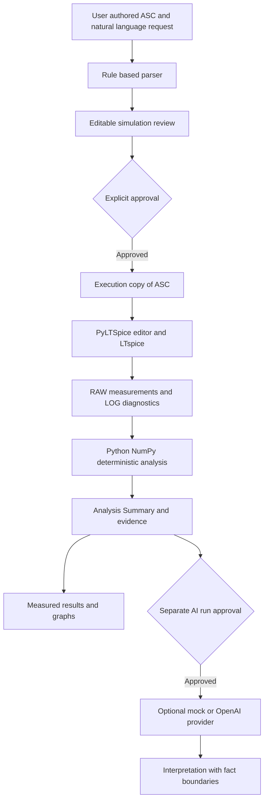

# Circuit Simulation Assistant — Portfolio Case Study

이 문서는 회로 분석 도구를 설계하고 검증한 과정을 설명한다. 2026-10-04 기준 저장소 기록과 공개 CI/Release를 근거로 작성했으며, 이번 문서 작업에서 simulation이나 test suite를 재실행하지 않았다. 면접용 답변과 STAR 사례는 [Interview Pack](interview-pack.md)에 정리했다.

## 1. Project Summary

Circuit Simulation Assistant는 사용자가 작성한 LTspice 회로의 반복적인 simulation 설정과 결과 측정을 돕는 Streamlit 도구다. 자연어 요청을 규칙 기반으로 구조화하고, 사용자의 검토·승인 이후 원본 대신 ASC 복사본을 실행한다. 실제 RAW 데이터의 gain, bandwidth, Vpp, DC 값과 sweep 비교는 Python/NumPy로 계산한다. 선택적인 LLM은 이 수치를 만드는 역할이 아니라, 계산 이후의 Analysis Summary를 해석하는 역할을 맡는다. 핵심 성과는 자동화 범위와 측정 근거를 분리하면서 실제 LTspice 실행, Windows 배포와 테스트 재현성을 연결한 것이다.

### Resume bullet — Korean / English

- **한국어:** LTspice 실행·Python 정량 분석·사용자 승인·선택적 AI 해석을 분리한 회로 simulation 도구를 개발하고, Windows v0.1.1 배포와 184개 자동 테스트/Windows CI로 검증했다.
- **English:** Built a circuit simulation assistant separating approved LTspice execution, deterministic Python measurements, and optional AI interpretation; published a Windows v0.1.1 installer and verified 184 automated tests in Windows CI.

### Three-line summary — Korean

1. 사용자가 작성한 LTspice ASC와 자연어 요청을 검토 가능한 simulation 조건으로 변환한다.
2. 승인된 복사본에서 AC / Transient / DC / Parameter Sweep을 실행하고 RAW를 Python으로 측정한다.
3. 수치와 AI 해석의 경계를 유지하며 공개 예제, Windows installer와 재현 가능한 자동 테스트를 제공한다.

### Three-line summary — English

1. Converts requests for user-authored LTspice schematics into reviewable simulation conditions.
2. Executes approved copies and measures AC, Transient, DC, and Parameter Sweep results in Python.
3. Separates numerical evidence from AI interpretation, with a public example, a Windows installer, and reproducible automated tests.

### Portfolio description — Korean

Circuit Simulation Assistant는 아날로그 회로를 공부하면서 반복적으로 수행하는 simulation 설정과 결과 측정을 정리하기 위해 만든 프로젝트다. 사용자는 LTspice에서 직접 회로를 작성하고 ASC 파일과 자연어 요청을 입력한다. 앱은 지원하는 표현을 규칙 기반 parser로 읽어 분석 종류, 범위, 관측 신호와 측정 항목을 구조화한다. 사용자는 조건을 수정하고 승인한 뒤 실행하며, 원본 회로는 유지되고 실행용 복사본만 변경된다.

정량 결과의 근거는 LLM 응답이 아니라 실제 LTspice RAW와 Python 계산이다. AC에서는 Target과 Reference의 complex 비율로 gain을 구하고 초기 구간의 median과 log-frequency 보간으로 bandwidth를 측정한다. Transient에서는 선택한 구간의 Input 및 Output Vpp를 비교하고, DC에서는 요청한 지점의 값을 보간한다. Parameter Sweep은 같은 분석 경로를 재사용하며 point별 실패와 부분 측정을 함께 남긴다.

선택적인 AI Interpretation에는 계산이 끝난 구조화 Summary만 전달한다. 측정 사실, deterministic 변화량, 경고와 해석을 구분하고, simulation 승인과 외부 API 호출 승인을 별도로 둔다. Codex는 구현과 디버깅을 보조했지만 범위 결정과 검토는 사람이 수행했다. 실제 simulator 실행과 synthetic test를 서로 다른 검증 근거로 기록했다.

개발 과정에서는 간헐적인 Windows 종료 hang을 socket cleanup까지 추적했고, 로컬에서 통과하던 테스트가 GitHub runner에서 실패하는 환경 의존성도 제거했다. 공개 NMOS 예제와 Windows v0.1.1 installer를 제공하며 현재 Windows CI에서 184개 테스트가 통과한다. 다만 clean Windows VM과 실제 OpenAI API smoke test는 미수행이고 installer는 unsigned다. 이 프로젝트는 회로 설계 작업의 측정과 재현성을 보조하는 도구이며, 그 자체로 transistor-level IC 설계 역량 전체를 입증하지는 않는다.

### Portfolio description — English

Circuit Simulation Assistant is a tool for repetitive circuit simulation and measurement tasks. Users author an LTspice schematic, upload its ASC file, and describe an analysis request. A rule-based parser converts supported expressions into editable conditions. Execution requires explicit approval and modifies a copy rather than the original schematic.

PyLTSpice connects the workflow to actual LTspice execution. Python and NumPy compute quantitative results from RAW data, including AC transfer-function gain and bandwidth, transient Vpp gain, DC values, and parameter-sweep comparisons. An evidence-backed Analysis Summary separates measurements, deterministic comparisons, and warnings. Optional AI interpretation consumes this summary after analysis; it is not the source of circuit measurements.

The engineering work also covered reproducibility and Windows deployment. I investigated an intermittent shutdown hang through signal, task, and socket evidence, then scoped a Windows event-loop policy change to the launcher bootstrap. When local tests failed on GitHub-hosted Windows, I removed hidden symbol-library dependencies and corrected filesystem identity and child-environment assumptions without changing production behavior.

The repository includes a public educational NMOS example and a published v0.1.1 installer. Windows CI passes 184 automated tests. Clean Windows VM validation and an actual OpenAI API smoke test remain outstanding, and the installer is unsigned. The project demonstrates simulation tooling and verification discipline alongside, rather than replacing, circuit-design work.

위 test count, 공개 상태와 측정값의 근거는 제6절에 모았다.

## 2. Problem Definition

회로마다 directive를 편집하고 trace를 선택한 뒤, graph에서 값을 읽어 다른 실행 결과와 비교하는 작업은 반복이 많다. 조건과 결과를 따로 관리하면 서로 다른 주파수 범위나 측정 구간의 값을 같은 것으로 비교할 위험도 있다. 이 도구는 설정을 구조화해 확인할 수 있게 하고, 측정 정의와 evidence를 결과에 남긴다.

LLM에 graph나 요청 문장만 주고 gain을 계산하게 하면 Reference, 단위, 측정 구간과 미검출값 처리 방식을 검증하기 어렵다. 수치 계산은 RAW에 기반한 코드로 수행하고, LLM 설명에는 사실과 추론을 분리하는 계약을 두었다. 시간 단축률이나 설계 성능 향상률을 측정한 사용자 연구는 없으며 그런 효과를 주장하지 않는다. 배경은 [Problem Definition](../problem-definition.md)과 [Scope](devlog/00-problem-definition-and-scope.md)를 참조한다.

## 3. System Architecture

Parser가 제안한 조건을 사용자가 Review에서 확정한다. 조건을 수정하거나 trace suggestion을 선택한 뒤에도 승인 gate를 유지한다. PyLTSpice 편집 API로 실행용 ASC의 directive를 갱신하고 LTspice RAW에서 측정한다. LOG는 진단과 실행 evidence로 보존하며, 정량 측정의 입력은 RAW다.

AC / Transient / DC의 parser와 결과 분석을 분리하고, Parameter Sweep은 공통 실행·측정 경로를 재사용한다. Summary에는 파일 참조를 남기되 LLM prompt에서는 local path와 RAW 배열을 제외한다. 구현 진입점은 [app.py](../app.py), [Simulation Runner](../simulation_runner.py), [Analysis Summary](../analysis_summary.py), [AI Interpretation](../ai_interpretation.py)다.

## 4. Key Engineering Decisions

| Decision | Why | Trade-off |
| --- | --- | --- |
| 수치는 Python/NumPy, LLM은 결과 해석 | 측정 정의와 입력 RAW를 추적하고 같은 입력에서 같은 값을 계산한다 | 측정마다 정의·적용 조건·test가 필요하다 |
| 실행 전 명시적 승인 | Parser의 오독과 미지정 조건을 실행 전에 수정할 수 있다 | 무인 실행보다 사용자 단계가 늘어난다 |
| 원본 ASC 보존, 복사본 편집 | directive나 component 변경을 사용자 설계에 덮어쓰지 않는다 | 실행 복사본과 결과 관리가 필요하다 |
| 규칙 기반 parser와 수정 가능한 Review | API/key 없이 동작하며 지원 표현을 검증할 수 있다 | 임의의 자연어를 모두 이해하지 못한다 |
| Summary의 measured / derived / warnings 분리 | 실패·결측을 보존하며 향후 해석 입력을 제약한다 | JSON 형식만으로 물리적 정확성을 보장하지 못한다 |
| 단일 분석 module을 sweep에서 재사용 | 각 point와 단일 실행의 측정 정의가 같다 | 순차 실행이며 nested sweep·취소/재개는 지원하지 않는다 |
| mock/OpenAI provider와 별도 API 승인 | network/SDK와 회로 계산을 분리하고 실제 key 없이 테스트한다 | mock은 고정 데모이며 실제 API 품질은 별도 검증이 필요하다 |
| PyInstaller onedir + Inno Setup | Python 개발 환경 없이 Windows package를 배포한다 | 외부 LTspice, 서명과 OS별 검증은 별도 과제다 |

근거: [Integration](devlog/02-ltspice-integration.md), [Summary](devlog/07-analysis-summary.md), [AI Architecture](devlog/08-ai-interpretation-architecture.md), [Release](releases/v0.1.1.md).

## 5. Implementation Scope

| 분석 | 구현한 측정과 경계 |
| --- | --- |
| AC | `H(f) = Target(f) / Reference(f)`, `20 * log10(abs(H))`. 첫 최대 10개 sample 구간의 유효 gain median을 baseline으로 사용하며 최소 3개 유효 sample이 필요하다. baseline−3 dB의 첫 하향 crossing을 dB 대 log-frequency로 보간한다. 결측 구간을 건너뛰거나 범위 밖으로 외삽하지 않는다. low-pass를 우선한 정의다 |
| Transient | 마지막 안정된 입력 3주기의 공통 구간에서 Input/Output Vpp와 진폭비를 계산한다. 저장 구간 전체의 Output Swing은 별도 측정이다. step-like 조건을 만족하는 파형에 rise/fall, overshoot, settling을 적용하고 부적절한 파형에는 값을 생성하지 않는다 |
| DC Sweep | 단일 독립 전압/전류원을 sweep한다. signed min/max, 범위 내 지정점 선형 보간, trace 간 차이와 matching error를 계산한다. matching error의 분모는 Target 절댓값이며 0 근처를 제외한다 |
| Parameter Sweep | 단일 R/C의 명시값 또는 start/stop/step을 순차 실행한다. point별 상태·evidence, 비교 표, metric graph, AC overlay를 제공한다. simulation failure와 partial measurement를 구분한다 |

Summary는 기존 측정값을 정리하고 차분·extrema·trend를 deterministic하게 기록한다. non-finite 값은 JSON의 `null`과 warning으로 남기며 실패 point 사이를 메워 trend를 만들지 않는다. 물리적 원인을 설명하는 회로 진단은 이 처리에 포함하지 않는다.

정의와 테스트 근거: [AC](devlog/03-ac-analysis.md), [Transient](devlog/04-transient-analysis.md), [DC](devlog/05-dc-sweep.md), [Sweep](devlog/06-parameter-sweep.md), [Summary](devlog/07-analysis-summary.md).

## 6. Real Validation

### Automated tests / CI

2026-10-04 로컬 기록은 **184 tests, skip 0, failures/errors 0, exit 0**이다. 최신 remote run은 main `dc95893`의 **[Actions run 37201683504](https://github.com/minsu727/circuit-simulation-assistant/actions/runs/37201683504)**로, Windows job이 성공했고 log에 `Ran 184 tests`와 `OK`가 있다. workflow는 [Windows CI](../.github/workflows/test.yml), 로컬 상세는 [Validation](validation.md)을 참조한다. 후자의 “수정 후 remote 미확인”은 당시 기록이며, 이 case study의 remote 결과는 후속 run을 read-only로 확인한 것이다.

Unit/AppTest는 parser, 승인 gate, 계산, provider fake/mock과 환경 의존성을 검증한다. CI는 실제 LTspice, installer, browser, 실제 API를 실행하지 않는다. test count는 release 이후 달라졌으므로 v0.1.1 당시 183개를 현재 184개로 바꾸지 않는다.

### Actual LTspice / public example

공개 [Common-Source NMOS Example](../examples/common_source_amplifier/README.md)은 이 repository를 위해 범용 소자와 교육용 Level-1 NMOS model로 새로 작성했다. 비공개 수업 회로에서 가져오지 않았고 실제 소자 성능을 검증하는 모델도 아니다. LTspice 26.0.1 / Windows 실행 기록의 대표값은 다음과 같다.

| 실행 | 승인한 조건 | 실측 결과 |
| --- | --- | --- |
| AC | `V(vout)/V(vin)`, `.ac dec 100 10 1Meg` | Low-frequency gain **12.943 dB**, −3 dB BW **8.256 kHz** |
| Transient | 같은 Target/Reference, `.tran 0 10m 5m 2u` | Input **10.000 mVpp**, Output **44.058 mVpp**, gain **4.406 V/V** |

Review/approval을 포함한 실행에서 RAW/LOG, graph, Summary를 생성하고 원본 ASC hash가 변하지 않았음을 확인했다. Transient 요청의 시간 조건과 Reference는 자동 확정하지 않고 Review에서 위 값으로 지정한다. 저주파 AC gain과 1 kHz sine의 Vpp gain은 다른 측정이며 formal physical cross-validation이 아니다. 값은 simulator/model/조건에 따라 달라지고 LOG의 Level-1 model 경고도 유지한다.

기존 AC / Transient / DC / Parameter Sweep의 실제 LTspice 검증은 [Validation](validation.md)과 [개발 글](devlog/README.md)에 있다. 공개 NMOS의 위 값과 과거의 다른 MOSFET·divider·mirror fixture 수치를 섞지 않는다.

### Windows package

**[v0.1.1은 공개됐다](https://github.com/minsu727/circuit-simulation-assistant/releases/tag/v0.1.1)**. release source는 `442b9bc`로 현재 main의 CI commit과 구분한다. [Release evidence](releases/v0.1.1.md)는 developer-host의 portable/installed UI, LTspice detection, install/uninstall, icon/shortcut과 반복 종료를 기록한다. 공개 예제는 repository에 포함되며 이미 게시된 installer에 동봉됐다고 주장하지 않는다.

### Claims audit

| 공개·정량 claim | 근거 / 범위 |
| --- | --- |
| 로컬 184 tests, skip 0, exit 0 | [Prompt 024B validation](validation.md). 이번 문서 작업에서 재실행하지 않았다 |
| remote Windows CI, 184 tests 성공 | [2026-10-04 successful run](https://github.com/minsu727/circuit-simulation-assistant/actions/runs/37201683504), main `dc95893`의 log와 conclusion 확인 |
| 공개 예제 AC / Transient 대표값과 원본 보존 | [Example evidence](../examples/common_source_amplifier/README.md). 정밀도 보장이나 실측 소자 특성이 아니다 |
| AC / Transient / DC / Sweep 실행 | [Validation](validation.md), [개발 글](devlog/README.md). CI가 simulator를 실행했다는 claim은 하지 않는다 |
| v0.1.1 공개, release source `442b9bc` | [Published Release](https://github.com/minsu727/circuit-simulation-assistant/releases/tag/v0.1.1), [release record](releases/v0.1.1.md). draft/prerelease가 아님을 read-only 확인 |
| portable/installed 각 3회, shortcut 각 1회 정상 종료 | [Shutdown results](releases/v0.1.1.md). 시간과 exit 값은 제7절에 있으며 같은 developer-host에서 유한 횟수 실험한 결과다 |
| CI 첫 실행 183 tests, 6 failures / 1 error | [Failed run](https://github.com/minsu727/circuit-simulation-assistant/actions/runs/37199913216), [failure diagnosis](validation.md). 후속 184개 성공과 다른 시점이다 |
| mock/fake provider tests, 실제 API smoke 미실시 | [AI architecture](devlog/08-ai-interpretation-architecture.md), [limitations](releases/v0.1.1.md). 실제 API 품질·연결 성공은 주장하지 않는다 |
| clean VM 미실시, unsigned, SmartScreen 가능, LTspice 별도 | [Release limitations](releases/v0.1.1.md). 공개됐다는 사실이 검증 범위를 넓히지 않는다 |

## 7. Debugging Case Study — Windows Shutdown

- **Symptom:** 종료 신호 뒤 `Stopping...`이 나오지만 간헐적으로 45초가 지나도 종료되지 않았다. 이전 installed 15초/45초 검증은 forced termination, exit 1이며 성공으로 취급하지 않는다.
- **Hypotheses:** 신호 전달 실패, parent/child 오인, 설치 경로, icon/shortcut, server/task 종료 대기를 나눠 조사했다.
- **Experiments:** single-PID Streamlit server와 process group, 신호 도달을 확인했다. 정상 실행은 짧게 종료됐지만 기존 portable binary에서도 **45.028초** hang을 재현했다. 단순 TCP reset이 항상 재현 조건은 아니었으며 browser upload/review와 FIN→RST 연결을 포함해 task/socket 상태를 수집했다.
- **Root Cause:** Python 3.13.5 Windows Proactor의 `_ProactorBasePipeTransport._call_connection_lost`에서 **WinError 10054**가 발생해 socket shutdown 예외가 close / server detach / completion flag 처리를 건너뛰는 경로를 확인했다. Uvicorn connection/task가 0이어도 asyncio server에 closing transport/socket이 남아 `Server.wait_closed()`가 완료되지 않았다. 공통 runtime defect이며 설치 경로 문제나 단순 verifier false negative가 아니었다.
- **Fix:** pinned Streamlit bootstrap 범위에만 Windows Selector event-loop policy를 적용하고 종료/예외 시 이전 policy를 복원했다. 기존 lifecycle과 signal handler를 유지하며 production에 forced-kill workaround를 넣지 않았다. Verifier는 forced cleanup과 nonzero exit를 실패로 기록한다.
- **Regression Validation:** UI flow와 실행당 100회 FIN/RST 연결을 포함한 검증에서 portable 3회는 **0.596 / 0.667 / 0.343초**, installed 3회는 **0.508 / 0.552 / 0.557초**였다. Start Menu는 **0.819초**, Desktop은 **0.622초**였다. 모두 exit 0, fallback 없음, listener 종료, orphan app 0이었다. 같은 developer-host의 관측이며 모든 Windows를 보장하지 않는다.

Selector의 socket capacity와 async subprocess/pipe 제약은 runtime 변경 시 다시 평가해야 한다. 현재 simulator 실행은 동기적이다. 실패 이력·성공값·수정 근거는 [v0.1.1 shutdown record](releases/v0.1.1.md), 구현은 [launcher.py](../launcher.py), 엄격한 종료 판정은 [shutdown_checks.py](../tests/shutdown_checks.py)에 있다.

## 8. Debugging Case Study — CI Portability

- **Symptom:** 로컬에서 성공한 suite가 첫 GitHub Windows runner에서 **183 tests, 6 failures / 1 error, exit 1**로 실패했다.
- **Hypotheses:** 제품 로직 regression과 외부 symbol, path 표기, PowerShell 부모/자식 환경 의존성을 구분했다.
- **Experiments:** `AscEditor`가 runner에 없는 `voltage.asy`를 참조하고, 8.3 path와 long path가 같은 파일인데도 문자열 비교에 실패함을 확인했다. 첫 CI log에는 child module path 상세가 없어 그 값을 직접 측정했다고 쓰지 않는다. 로컬에서 PS7 전용 shared-module manifest로 Windows PowerShell 5.1의 `Get-FileHash` 미검출을 재현하고 환경 수정 후 회복을 검증했다.
- **Root Cause:** 테스트가 개발 PC의 LTspice symbol library, path 표기 일치와 부모에게서 상속한 `PSModulePath` 호환성에 의존했다. 세 번째 항목은 CI 관측과 로컬 재현을 구분해 설명한다.
- **Fix:** 직접 작성한 repository-local 최소 symbol fixture를 사용하며 실제 editor/edit/save 검증을 유지했다. 기존 파일의 identity는 `Path.samefile()`로 비교하되 단일 Path 전달과 공백 경로 검사는 유지했다. test harness의 child 환경에서 `PSModulePath`를 제거해 Windows PowerShell의 표준 경로를 구성하게 했다. production helper, workflow, 계산 코드는 바꾸지 않았고 test skip이나 editor mock으로 우회하지 않았다.
- **Regression Validation:** 실제 8.3 temp path의 targeted **30 tests**와 full **184 tests, skip 0, exit 0**이 로컬에서 통과했다. 후속 remote [run 37201683504](https://github.com/minsu727/circuit-simulation-assistant/actions/runs/37201683504)도 184 tests 성공이다. module path 실패와 수정 후 회복을 함께 검사하는 regression을 추가했다.

로컬 green이 환경 독립적인 test를 뜻하지 않는다는 것이 이 사례의 핵심이다. 근거: [CI diagnosis](validation.md), [symbol provenance](../tests/fixtures/editor_symbols/README.md), [release validation tests](../tests/test_release_validation.py).

## 9. AI-Assisted Development Method

개발은 problem definition → SPEC → 좁은 구현 prompt → 구현 → unit/AppTest와 실제 LTspice 검증 → 사람의 review → commit 순서로 진행했다. Codex는 implementation, debugging, tests, packaging, documentation을 보조했다. 모든 줄을 직접 작성했다고 설명하지 않으며 prompt만 보내면 검증까지 끝났다고 설명하지도 않는다.

범위를 AC directive, RAW 분석, sweep parsing/execution, Summary, AI preview 등으로 나누고 실패 시 evidence를 다시 읽어 원인과 수정을 대응시켰다. 개발을 돕는 AI와 제품 내 optional AI Interpretation은 다른 역할이다. 설계 범위, 승인과 결과 평가는 사람이 맡고 회로 수치는 deterministic code와 실제 simulator로 확인했다. [Prompt log](prompt-log.md)와 [Development log](development-log.md)에 경위를 남겼다.

## 10. What I Learned

- 수치 계산과 설명을 나누고 결측·적용 불가·실패를 schema에 남겨 오해 가능성을 줄일 수 있다.
- `.raw` 생성과 올바른 측정은 다르다. Transient 저장 시작 Offset과 공통 관측 구간까지 확인해야 한다.
- Shutdown은 signal 도달이나 connection count만으로 판정할 수 없다. task, transport, listener, process, exit code를 함께 확인해야 한다.
- file identity와 path string equality는 다르며 부모 shell의 환경도 test 입력이다.
- Release는 binary 완성뿐 아니라 resource path, writable data, 외부 simulator, checksum과 검증 범위 문서화까지 포함한다.
- AI 수정안도 가설로 다룬다. timeout 연장이나 결측 수치 채우기가 아니라 재현 실험이 수정 근거가 된다.

## 11. Limitations

- Clean Windows VM validation은 미실시다. installer는 unsigned이며 SmartScreen warning이 나올 수 있다. Defender, all-users in-place upgrade, 모든 Windows 호환성을 검증했다고 주장하지 않는다.
- LTspice는 별도 설치가 필요하다. core portable package에 LTspice/OpenAI SDK를 동봉하지 않으며 실제 OpenAI provider는 optional dependencies를 설치한 개발 환경을 대상으로 한다.
- Actual OpenAI API smoke test는 미실시다. mock/fake tests로 API 연결 품질이나 회로 해석의 물리적 정확성을 보장하지 못한다.
- 수치/단위 guardrail은 같은 값을 다른 trace/point에 잘못 귀속한 설명이나 근거 없는 물리적 원인을 완전히 배제하지 못한다. path 제외도 일반적인 privacy 보장은 아니다.
- AC bandwidth는 low-pass를 우선한다. Transient step metrics에는 적용 조건이 있다. formal AC–Transient / DC–Transient physical cross-validation은 미완료다.
- Parser는 지원 패턴에 한정한다. 임의 회로 자동 설계, nested sweep, Word report, 이미지 기반 circuit reconstruction은 구현 범위 밖이다.
- 과거 MOSFET integration은 비공개 회로 구성에 의존하므로 fresh clone에서 그대로 재현할 수 없다. 공개 NMOS 예제는 별도의 AC/Transient 재현 경로이며 과거 모든 fixture의 대체품은 아니다.
- 공개 Level-1 NMOS는 교육용 모델이다. 실제 IC의 PVT, device sizing, layout, noise, stability, post-layout 검증 실적을 이 결과로 주장하지 않는다.

## 12. Future Work

우선할 작업은 clean-machine packaging validation, 제한적인 실제 API smoke test, 측정 정의와 적용 범위 추가 검증이다. 새 분석 종류를 늘리기 전에 환경과 결과의 재현 조건을 명확히 한다.

향후 v0.2 구상에는 **circuit image → vision extraction → Circuit JSON / net graph → deterministic connectivity validation → simulator input**이 있다. 미구현 방향이며 이미지만으로 신뢰할 회로를 자동 생성할 수 있다는 claim이 아니다. 연결 유효성과 사람의 review를 먼저 설계해야 한다.

반도체 설계 직무에는 simulation 조건, 회로 metric, AC/Transient/DC 구분과 재현성을 중심으로 설명한다. Cadence/Virtuoso 작업, 수업이나 별도 회로 설계 자료가 있다면 그 보조 도구로 제시한다. 실제로 하지 않은 IC 설계 경험을 이 software project로 대체하지 않는다. [면접용 직무별 설명](interview-pack.md)을 참조한다.
