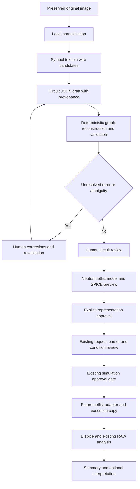

# v0.2 Architecture (Proposed / Not Implemented)

Every scope, threshold, module boundary and technology choice below is a **future proposal**, not an implemented feature or measured recognition result. See the [index](README.md), [Circuit JSON contract](circuit-json-schema.md) and [validation rules](validation-rules.md).

## 1. Scope and Admission

| Phase | Proposed input and scope | Admission / exclusions |
| --- | --- | --- |
| A / M1–M5 | One clean LTspice screenshot; a finite symbol catalog; orthogonal wiring; recognizable terminals, dots and labels | No perspective photos, obscured circuits, multiple sheets, hierarchy, handwriting or arbitrary symbols |
| B / M6 | Repository-created textbook-style diagrams | Separate symbol/crossing profiles; no copied textbook scans |
| C / later | Hand-drawn circuit research | Separate dataset and correction UX; excluded from the first implementation |

Phase A device primitives: resistor, capacitor, inductor, independent voltage/current source, NMOS and PMOS. Ground, wire and net label are topology features, not exported device components. Diode, BJT, op amp, dependent/behavioral source, subcircuit and transformer are excluded initially. An unsupported device blocks conversion; it must not be dropped to produce a partial circuit.

MOS devices have four neutral terminals: drain, gate, source and bulk. A three-pin symbol requires an explicit catalog body convention and human confirmation. Position alone cannot determine bulk connection. Model, W/L and hidden source waveforms require manual input if absent from the image. Start with reviewed local educational model profiles and typed DC/AC/SINE/PULSE sources; do not claim real-device characterization.

## 2. Boundaries and Data Flow

Extraction, validation, generation and execution are distinct responsibilities. Simulator success cannot retroactively confirm a visual guess. The following names describe proposed boundaries, not source files created by this prompt.

| Boundary | Contract |
| --- | --- |
| Image ingestion | Immutable original reference and safely decoded working image; no network transfer |
| Extraction provider | Visual observations and alternatives; returned directives/netlists are never executable inputs |
| Circuit assembler | Accepted visual constraints to draft JSON, with catalog/version/geometry provenance |
| Graph validator | Revision-specific deterministic findings; cannot manufacture user approval |
| Circuit review | Explicit edits, new revision and revalidation; preserve original observations |
| Neutral exporter / LTspice adapter | Reviewed graph to typed device rows and allowlisted SPICE preview; no raw OCR code |
| Simulation integration | Approved representation plus approved conditions to an execution copy; reuse RAW/LOG checks and analysis |

## 3. Electrical Graph

Recommend a **component–pin–net typed incidence graph**. Canonical records are JSON components, pins, nets and connections. Python ID-to-record dictionaries and adjacency sets are sufficient for the MVP.

- Component nodes represent device identity/type/value/model, not conduction between all terminals.
- Pin nodes carry unique IDs and roles, such as `R1.a` or `M1.gate`.
- Net nodes represent equipotential sets reconstructed from accepted wire/junction/label constraints.
- Ownership edges connect a component to its pins; every pin has exactly one owner.
- Incidence edges connect a pin to a net; draft pins may be unresolved, generation-ready pins must have exactly one net.
- Wire segments and junction evidence remain visual records. An ambiguous crossing is not an accepted electrical edge.

A component–net bipartite graph loses terminal roles unless extra annotations are added. A flat netlist is useful for export but insufficient for visual ambiguity and editing. The typed graph supports pin-level corrections; export projects each device into its ordered terminal list.

**Graph connectivity is not DC conductivity.** A MOS ownership edge does not establish a conducting path through its gate. Use a separate device-aware DC projection: R is finite resistance, C is DC open, L is ideal DC short, an independent V source supplies a potential constraint, and an I source does not establish a reference potential. Nonlinear MOS channel/body behavior depends on bias/model and cannot be certified by ordinary reachability.

Use the incidence graph for orphan pins/devices, isolated subnetworks, same-net source terminals and label conflicts. Use the DC projection for clearly floating linear/gate-only nodes; report uncertain nonlinear reference paths without pretending to prove an operating point. Grounded independent branches are not automatically invalid. Rules are specified in [validation-rules.md](validation-rules.md).

## 4. Vision Pipeline

| Stage | Inference / deterministic boundary | Proposed output and failure handling |
| --- | --- | --- |
| 1. Normalize | Decode and fixed transforms are deterministic; estimated deskew is a hypothesis | Preserve hash, dimensions and original-to-working transform; reject unreadable inputs |
| 2. Detect symbols | Template/CV or learned/multimodal candidates | Bounding boxes, type alternatives and catalog identity; retain unknown regions |
| 3. Recognize text/values | OCR/multimodal inference | Literal text, alternatives and grammar; never insert raw text into SPICE |
| 4. Localize pins | Transform known catalog geometry deterministically; catalog/type/pose choice is inferred | Rotation/mirror and terminal candidates; unresolved D/S/B mapping blocks progress |
| 5. Extract wires | Fixed pixel algorithms still infer electrical meaning | Segments/endpoints/gap candidates; never bridge gaps solely because they are close |
| 6. Detect junctions | Dot/bridge/crossing interpretation is uncertain | Connected/unconnected alternatives; do not union every crossing |
| 7. Reconstruct nets | Union-find over accepted endpoints/junctions/labels is deterministic | Reproducible membership and IDs; retain unresolved edge hypotheses |
| 8. Associate labels | Text-to-wire attachment is inferred; accepted scope rules are deterministic | Attachment choices, aliases and conflicts; proximity alone is insufficient |
| 9. Assemble JSON | Closed-schema assembly and checks are deterministic | Draft JSON and provenance; providers cannot set validated/approved state |

### Approach Comparison

| Approach | Strengths | Weaknesses / expected failures | Effort |
| --- | --- | --- | --- |
| A. Multimodal LLM-first | Quick candidate-JSON prototype; joint text/symbol interpretation | Invented or missed devices, wrong crossings, unstable output, unjustified confidence, privacy/network/cost | Low initial effort; substantial later work on geometry, reproducibility and corrections |
| B. Hybrid CV + optional OCR/multimodal + deterministic reconstruction | Separates geometry and interpretation; local evidence; graph checks independent of model | Thin-line gaps, junction dots and style variation; threshold tuning and multi-stage errors | Moderate initial effort, contained by a finite Phase A catalog |

**Recommend B.** Start with local CV, finite catalog geometry and manual correction. Add optional OCR/cloud multimodal providers as replaceable candidate sources, not mandatory runtime dependencies. A single model call must not supply the trusted graph or executable netlist. Deterministic pixel processing also does not prove true connectivity; benchmark and review remain necessary.

## 5. Human Review UX — Proposed MVP

Desktop: original image on the left; component/value/pin-net tables and findings on the right. Selecting an item highlights its bounding box, ID and net overlay. Narrow screens stack the panels. Use text IDs and status, not color alone; overlays use original pixel coordinates.

Use tables/select forms instead of a full schematic CAD editor. Minimum edits: confirm item, change type/value, select model/source settings, reconnect a pin, assign a label, merge/split nets, add/remove a component. Merge/split requires explicit pin membership and a before/after preview. Removal updates owned pins and connections atomically.

Show an ambiguity queue such as `3 ambiguous items detected`. Each item includes a crop, candidate choices and affected terminals. Manual corrections also pass validation; human input cannot waive an ERROR. Store decisions with revisions, and never confirm unrelated unresolved items in bulk.

Even a structurally valid graph requires comparison against the full image. The sequence is circuit review → generate preview → approve representation → existing condition review/approval. Preview includes node/device mapping, source/model configuration and netlist text. Edits invalidate dependent approvals; previous results remain associated with their old revision.

## 6. Simulator Conversion and v0.1 Integration

| Option | Benefits | Cost / compatibility |
| --- | --- | --- |
| A. SPICE netlist first | Explicit terminal order, values and models; easy golden/diff testing; no symbol placement | Adapter for the ASC-only app; source/sweep validation and trace-name mapping required |
| B. LTspice ASC first | Graphical editing and closer to current upload path | Additional placement/rotation/wire/label-coordinate problem; visual similarity does not prove connectivity |
| C. Both eventually | Multiple exporters from the same neutral graph | More semantic-equivalence and round-trip tests |

**Start with A.** Reviewed Circuit JSON → neutral device rows (type, ordered terminals, SI quantities, typed source/model references) → restricted LTspice/SPICE netlist. ASC export is later work. This prompt generates neither format.

Current [run_ltspice](../../simulation_runner.py) enforces an `.asc` suffix and uses AscEditor. A future M2 adapter must address the following explicitly:

1. Treat generated netlists as approved artifacts, not uploaded ASC files. Save execution copies; never overwrite original images or canonical JSON.
2. Validate DC source and R/C sweep identity using the neutral device catalog. Existing ASC-specific component discovery cannot be assumed to support netlists.
3. Export reviewed models/values/terminal order; apply existing AC/Transient/DC directive-builder output to a run copy. Keep natural-language parsers unchanged.
4. Verify SimRunner/SpiceEditor/LTspice netlist execution in M2. Preserve the ASC branch; reuse success/error and nonempty RAW/LOG checks through a narrow execution boundary.
5. Keep node ID → emitted name → actual RAW trace mapping. Preserve Target/Reference review and missing-trace behavior; do not silently substitute.
6. Reuse existing RAW analyzers, comparisons, Analysis Summary and optional downstream AI. Visual confidence is not measurement confidence. Keep import provenance in a separate evidence envelope; do not change the existing Summary schema in this prompt.

Export only safe allowlisted device/node names and typed fields. Reject newlines, directive injection, arbitrary `.include`/`.lib` and commands from extracted text. Use approved local model profiles. Sweep value changes belong to the existing sweep-condition approval and run copy; canonical circuit edits invalidate circuit approval. Adapter compatibility is a future acceptance test, not a current installer feature.

## 7. Failure Modes

Severity and blocking follow [validation rules](validation-rules.md). Some omissions are not detectable mechanically; passing validation is not proof of visual fidelity.

| Failure | Detection strategy | Severity | Automatic handling | Human review |
| --- | --- | --- | --- | --- |
| Missed component | Unexplained symbol region, dangling terminals, benchmark recall | AMBIGUOUS when detected | Preserve suspect region; do not invent a device | Full image/list comparison; add component |
| False component | Catalog mismatch, duplicate box/pins | AMBIGUOUS | Isolate suspect candidate | Keep/remove |
| Wrong type | Type alternatives, pin-count conflict | AMBIGUOUS / ERROR | No export choice | Correct type/catalog |
| Wrong value | OCR alternatives, grammar/dimension/finite checks | AMBIGUOUS / ERROR | Preserve literal and choices | Confirm crop/value |
| Broken wire | Endpoint gaps, disconnected pin | AMBIGUOUS | No proximity-only bridging | Confirm connection/separation |
| Missed junction | Uncertain dot/crossing region, ground-truth mismatch | AMBIGUOUS | Defer merge | Choose crossing interpretation |
| False junction | Bridge evidence, same-net source terminals | AMBIGUOUS / ERROR | Revert unconfirmed union to draft | Confirm connected/unconnected |
| Incorrect label | Competing attachment, scope collision | AMBIGUOUS / ERROR | No fuzzy rename | Fix attachment/name |
| MOS pin ambiguity | Unknown pose/catalog, missing D/G/S/B mapping | AMBIGUOUS | No orientation-only D/S swap | Verify roles/body |
| Missing ground | No accepted ground net | ERROR | No implicit node 0 | Explicit ground and image review |
| Unsupported symbol | Unknown/out-of-scope catalog | ERROR | No partial-circuit export | Use supported input |
| Rotated/mirrored symbol | Pose alternatives and pin transforms | AMBIGUOUS | Only supported catalog transforms | Verify pin position/role |
| Low-resolution image | Insufficient text/dot/pin evidence | ERROR at admission | Stop with quality report | Upload better image |
| Handwritten text | Unsupported Phase A style | ERROR at admission | Do not claim support | Supply clean diagram |
| Overlapping labels | Multiple text/attachment candidates | AMBIGUOUS | No deletion/averaging | Resolve each label/value |
| Multi-page/image circuit | Sheet/continuation indicators | ERROR in Phase A | No cross-image inference | Supply single self-contained circuit |

## 8. Technology Options

These are recommendations, not dependency additions. Recheck APIs and choose pins during implementation.

| Area | MVP proposal | Later option / trade-off |
| --- | --- | --- |
| Vision | Existing Pillow for decode; add OpenCV only after a Phase A prototype justifies it. Catalog/template, line/connected-component candidates and manual text correction | Optional OCR/multimodal; learned detectors need annotation, data and deployment resources |
| Graph | Python dict/set, union-find and explicit pin ordering | NetworkX when graph algorithms/visualization justify it; canonical JSON remains unchanged |
| Schema | JSON Schema Draft 2020-12 exchange contract; select an optional schema validator in M1. Standard dataclasses plus explicit semantic rules | Pydantic strict models offer typed boundaries but add coercion/configuration and duplicate-schema risks. Dataclasses alone do not validate JSON |
| UI | Existing Streamlit tables/forms, static overlay and selected crop | Interactive canvas/CAD editing is outside MVP |
| Simulator | Existing PyLTSpice/LTspice via a tested adapter | ASC exporter or other simulators only after neutral-model stability |

Official capability references: [OpenCV shape/connected-component APIs](https://docs.opencv.org/4.13.0/d3/dc0/group__imgproc__shape.html), [JSON Schema conditionals](https://json-schema.org/understanding-json-schema/reference/conditionals), [Pydantic models](https://pydantic.dev/docs/validation/latest/concepts/models/), [NetworkX bipartite tools](https://networkx.org/documentation/stable/reference/algorithms/bipartite.html). These describe building blocks, not circuit-recognition guarantees. The MVP recommendation is a project-specific design judgment.

## 9. Image Security / Privacy Boundary

Default to local processing. Decode, review and JSON correction must have a network-free path. Cloud vision requires separate consent showing provider, image/crops to send, purpose, retention policy and possible cost. Simulation approval and downstream AI approval are not cloud-image consent. Reruns/retries must not silently resend images.

Check file signature, permitted raster format and byte/pixel limits before processing. Proposed initial limits are 10 MiB, 16 megapixels and longest edge 8192 px, subject to benchmark/performance review. Detect decompression bombs using decoded dimensions, not compressed size alone. SVG/PDF/archive/executable input is outside Phase A.

Preserve original bytes locally. Strip EXIF and other unnecessary metadata from working/transmission copies. Exclude desktop/title-bar/path regions; show the exact crop for consent. Cropping cannot guarantee removal of identifying information. Retain coordinate transforms, and do not fetch arbitrary external URLs as image references.

Temporary decode/crop files require cleanup on success, cancellation and error, plus bounded startup cleanup after crashes. Original/approved JSON retention is a separate user choice. Never delete RAW/LOG evidence as image temporary data. Restrict cleanup to app-managed roots; reject traversal and unsafe symlink targets.

OCR text is untrusted data, including any apparent instructions embedded in the image. Model-returned JSON must pass closed-schema, semantic and exporter checks. Do not log API keys, image bytes or personal paths, or place them in public fixtures. A privacy threat model and verification remain future work.
