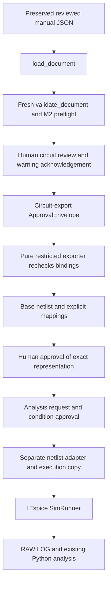

# M2 Architecture — Proposed / Not Implemented

## Flow and Authorities



Load failure produces no typed document. Technical or preflight failure produces no export. Circuit review precedes preview generation; representation approval follows it, preserving [ADR-004](../adr/004-human-approval.md). The prompt's approval-before-export path refers to the first approval, not to permission to execute unseen bytes. No approval is added to `TechnicalState` or to Circuit JSON.

Circuit input, report, approval, base artifact and run artifact are separate immutable snapshots. Derived ordered device rows are transient exporter views over `build_graph(document)`; they do not become a second circuit model or stored connectivity table. Only `Connection` supplies pin-to-net assignment.

## Current Interfaces Actually Inspected

| Existing boundary | Current behavior / proposed use |
| --- | --- |
| [Circuit IR exports](../../../circuit_ir/__init__.py) | `load_document(text) -> LoadResult`; `document_from_dict(data)`; `validate_schema(data)`; `build_graph(document) -> GraphBuildResult`; `validate_document(document) -> ValidationResult`; `document_to_dict`, `dump_document`, `parse_quantity`. No digest/export/approval API exists |
| [Models](../../../circuit_ir/models.py) | Frozen records; `ComponentType` R/C/L/V/I/NMOS/PMOS/UNKNOWN; roles a/b, positive/negative, drain/gate/source/bulk/unknown; `Quantity.si_value` is a decimal string; tuple parameters; `WaveformKind` NONE/SINE/PULSE |
| [Current runner](../../../simulation_runner.py) | `run_ltspice(uploaded_file, ac_conditions=None, *, transient_conditions=None, dc_conditions=None, component_update=None, approved=False)`. Rejects unapproved input before work, requires upload `.asc`, creates unique input/output folders, uses `AscEditor` for conditions/value edits, then `SpiceEditor(asc_path)` and `SimRunner.run_now` |
| [Directive builders](../../../ac_analysis.py), [Transient](../../../transient_analysis.py), [DC](../../../dc_analysis.py) | `build_ac_directive`, `build_transient_directive`, `build_dc_directive` return deterministic condition strings. `apply_analysis_directive` walks ASC directive blocks; it is not a generic netlist editing API |
| [Runtime paths](../../../runtime_paths.py) | `simulation_data_root()` selects source-run or packaged writable data; `configure_ltspice()` provides external LTspice discovery/configuration. No M2 export folder service exists |
| [AC reader](../../../ac_result_analysis.py), [Transient reader](../../../transient_result_analysis.py), [DC reader](../../../dc_result_analysis.py) | `read_ac_result`, `read_transient_result`, `read_dc_result` consume RAW paths and requested trace names; DC also receives `sweep_source`. These do not require an ASC source |
| [Summary](../../../analysis_summary.py) | Existing deterministic summaries can consume those result types. IR/export provenance remains a separate evidence sidecar; no Summary schema or numerical algorithm changes planned |

The inspected environment uses PyLTSpice 6.0.1 / spicelib 1.6.3; requirements do not pin those versions. Its compatibility `SpiceEditor` performs ASC-to-net conversion only for `.asc`, then delegates text parsing to spicelib. `SimRunner` exposes `run_now`, `okSim`, `completed_tasks` and editor serialization. This supports an **adapter proposal**, not proof of actual `.cir` compatibility. Recheck installed API behavior in M2E/F.

## Narrow v0.1 Adapter Strategy — M2E

Keep `run_ltspice` and its ASC upload contract intact. Add a separate future `netlist_runner.py` entry point for app-managed exporter results, not arbitrary uploaded text. Do not rename `.cir` to `.asc`, route it through `AscEditor`, or bypass guards by manufacturing an UploadedFile and passing `approved=True`.

1. Revalidate the source and recompute approval, base-text, mapping and trusted-model hashes. Require representation approval and a separately approved current analysis request. Every check precedes folder creation, editing and simulator invocation.
2. Resolve reviewed **IR IDs** through the supplied verified maps: DC source → emitted V/I element, selected net → explicit `V(emitted_node)`. If a label is used as a display hint, require the user to select its actual net; do not fuzzy-match or silently substitute a RAW trace.
3. Normalize a typed request snapshot (analysis type, reviewed settings, requested target/reference/comparison/point/measurements). A future `ExecutionApproval` binds its digest, representation-approval digest and base-netlist hash. This is separate from the current ASC boolean flow; ASC approval behavior is unchanged. A condition edit invalidates only this execution approval; source/model/artifact edits invalidate upstream approvals too.
4. Reuse the existing directive builders with **mapped** source names. On a new execution copy, insert exactly one generated AC/Transient/DC directive before `.end`, through a checked text-editor API. No user-supplied directive string and no ASC block-walking helper. Re-read the saved copy to check allowed tokens, one directive, terminal mappings and source/model lines unchanged. Package/editor newline or formatting changes are execution-artifact bytes, never silently substituted for approved base bytes.
5. Use public `SpiceEditor`/`SimRunner`/LTspice APIs for the copy, preserving success checks (`okSim`, failure return/exception details, non-empty RAW/LOG). These lower-level facilities are reusable; the current `run_ltspice` wrapper as a whole is not. Initially duplicate only that small execution boundary if factoring it would alter ASC behavior; a shared helper would require explicit regression evidence.
6. Supply exact emitted trace names to the existing RAW readers. Verify actual RAW availability and retain their existing missing-trace/error behavior. Node and element maps plus the observed RAW names remain evidence, not guessed success.

Generated IR parameter sweep execution is deferred beyond this initial M2 adapter. Current [parameter sweep execution](../../../parameter_sweep_execution.py), ASC component discovery, [AC reference suggestions](../../../ac_reference.py), upload validation and UI are ASC-specific and are not directly reusable for generated text. Preserve their behavior; do not expand them to claim M2 support.

## File Ownership and Provenance

The pure exporter returns text/metadata and performs no file/network/process I/O. Future caller-owned workspace under `simulation_data_root()`:

```text
simulation_input/<run_id>/m2/source.circuit.json  # retained app-owned snapshot
simulation_input/<run_id>/m2/base.cir             # approved base artifact
simulation_input/<run_id>/m2/export-evidence.json # hashes, mappings, approval references
simulation_input/<run_id>/m2/execution.cir        # derived approved condition copy
simulation_output/<run_id>/                      # RAW LOG graphs / run evidence
```

Run IDs/folders are unique runtime routing, excluded from deterministic export bytes and portable metadata. Fixed filenames are app-owned; source IDs, labels or model refs never become paths. Existing input/output Git exclusions apply. Preserve user JSON and its hash; never overwrite it, approved base bytes or earlier results. Verify root containment and reject traversal/symlink escape before writes/cleanup. Persist source/approval/execution digests, not personal paths, in portable evidence. Local result paths remain local-only evidence. Cleanup only app-owned temporary files; failed runs retain diagnostic evidence under current retention policy.

Artifact chain: exact typed snapshot + fresh report → circuit approval → base netlist/mappings → representation approval → condition approval → execution-copy hash → RAW/LOG. No artifact digest can include a later approval digest that itself hashes the artifact; [Approval Contract](approval-contract.md) defines the acyclic binding.

Official [PyLTSpice netlist editor documentation](https://pyltspice.readthedocs.io/en/latest/modules/read_netlist.html) describes text-netlist loading/editing and saving copies. Actual generated-netlist execution, source syntax, RAW naming and wrapper-save fidelity still require the [M2E/F tests](test-plan.md#later-real-ltspice-validation--m2f).
