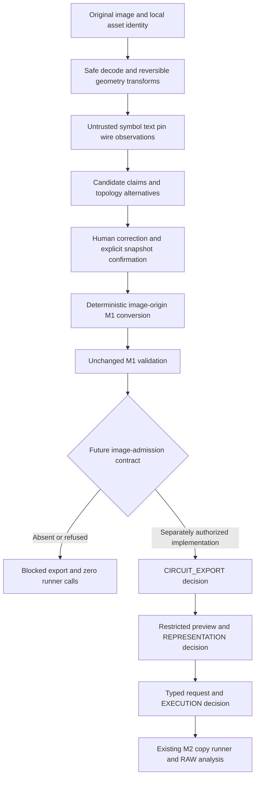

# M3 architecture

**Proposed contract, not implemented.** [Index](README.md) owns scope/baseline;
[Candidate Contract](candidate-contract.md) owns records and
[Review Contract](review-contract.md) owns promotion.

## Boundaries and ownership

| Boundary | Responsibility / forbidden authority |
| --- | --- |
| Intake | Decode bounded bytes, identify original/transmitted image, preserve geometry transforms; no provider call |
| Provider | Propose observations/alternatives; no canonical graph, circuit approval or executable content |
| Candidate assembler | Check references and infer constraints with evidence; never manufacture missing values or accept claims |
| Review controller | Apply explicit atomic edits, retain history, bind confirmed snapshot; no inference-based approval |
| M1 converter | Deterministically project accepted fields/relations to current types; no model call, defaults, I/O or simulator |
| M1 validator | Existing technical checks; no image-fidelity proof or human permission |
| Image admission | Future integrity/review policy separate from technical validation; currently unavailable |
| Existing M2 | Fresh circuit/representation/request bindings and generated-copy execution; no inferred approval |
| Existing analyzers | Numerical facts from verified RAW; no retrospective certification of visual interpretation |

Local image analysis can be deterministic while still producing incorrect
hypotheses. “Deterministic” describes repeatability, not truth.

## Practical approach comparison

These are design tradeoffs to evaluate on owned fixtures, not measured accuracy
claims or provider/product recommendations.

| Approach | Advantage | Main risk / effort |
| --- | --- | --- |
| A: direct multimodal extraction | Fast initial joint symbol/text/pose proposals | Plausible invented devices or connected crossings; opaque graph choices and unstable output |
| B: preprocess + OCR + vision | Separates crops/text, improves inspectability | OCR does not determine pin connectivity; preprocessing can erase dots; more stages need alignment |
| C: hybrid observations + deterministic reconstruction | Explicit evidence/constraints, reproducible graph and localized corrections | Requires a bounded symbol/style catalog; ambiguous geometry must remain unresolved |

**Choose C for the MVP**, with safe local normalization/wire candidates and
replaceable optional OCR/multimodal symbol/text proposals. This follows
[ADR-003](../adr/003-vision-pipeline.md). Start with static/fake provider responses
and manual correction; do not train a new detector or require a cloud SDK to use
the deterministic test/review path. OCR is optional, not a mandatory extra stage.

The model may propose type, literal, pose and terminal locations. Local code
validates response shape, transforms coordinates, enumerates wire contacts,
parses explicitly selected notation and reconstructs nets. A human confirms
critical type/value/role/connection decisions and the complete drawing. No union
is authorized merely because a model is confident.

## Actual repository alignment

| Inspected implementation | M3 use / limit |
| --- | --- |
| [models.py](../../../circuit_ir/models.py) | Frozen CircuitDocument, Origin.IMAGE, SourceImageReference, explicit pin roles and quantities already exist |
| [schema.py](../../../circuit_ir/schema.py), [serialization.py](../../../circuit_ir/serialization.py) | Strict current `0.2-draft1` shape/version, typed load and explicit serialization; no candidate fields |
| [graph.py](../../../circuit_ir/graph.py) | Connection is the only canonical pin–net assignment; no geometry-based electrical repair |
| [validation.py](../../../circuit_ir/validation.py) | Fresh M1 state; image reference/geometry and unresolved inference checks; asset resolution remains deferred |
| [approval.py](../../../circuit_ir/approval.py) | Snapshot/report/context binding, CIRCUIT_EXPORT and REPRESENTATION are separate explicit decisions |
| [exporter.py](../../../circuit_ir/exporter.py) | Manual-only initial admission; complete supported device/model subset, no arbitrary paths/directives |
| [execution.py](../../../circuit_ir/execution.py) | Typed AC/TRAN/DC requests, separate ExecutionApproval and fresh composition |
| [netlist_runner.py](../../../netlist_runner.py) | Public complete-chain runner, no arbitrary netlist-path shortcut; blocked chain means no files/runner |
| [netlist_result_analysis.py](../../../netlist_result_analysis.py) | Exact generated trace mapping to existing algorithms |
| [app.py](../../../app.py) | Current ASC upload/session condition review; no image uploader or v0.2 review workflow |

## Image admission is a required future design gate

Current `export_document` returns `EXPORT_UNSUPPORTED_FEATURE` for
`metadata.origin != MANUAL` **or** non-null `source_image_reference`, even if M1
is VALID and CIRCUIT_EXPORT was explicitly granted. A blocked preview cannot
receive valid representation/execution approval. Conversion does not remove
this restriction.

Recommendation for separately authorized M3E work: define a versioned
**image-aware admission policy** which verifies original asset integrity,
candidate/review/converted-document bindings and complete human dispositions.
Determine how that context is bound and rechecked at export, representation,
composition and run. Preserve all existing approval scopes, current manual
profile behavior/bytes and warning policies; do not globally allow image origin.

This is a prerequisite proposal, **not a new existing API or permission to edit
M2 in M3A**. M3E must present and obtain review of the minimal contract/interface
change before implementing it. Until then, image conversion + validation is
available only as future non-executing work; M3F true image-to-LTspice acceptance
is blocked, not replaced by a manual-origin shim.

Keep source image identity honest. Manually confirming connections may give
those decisions MANUAL confidence basis; it does not change Origin.IMAGE.
M1's `image_asset_resolution` stays deferred in its report; a later admission
policy establishes its own bounded evidence without rewriting M1 validity.

## Future app integration

A separate Image Review mode/tab can own intake, overlays, issue queue and
atomic forms; existing ASC mode remains untouched. Use distinct session keys
and revision-bound state rather than reusing the current ASC approval checkbox
as CIRCUIT_EXPORT, REPRESENTATION or candidate confirmation. The detailed
minimum UI is in [Review Contract](review-contract.md).

No graph rendering package, editable CAD canvas, provider SDK or new dependency
is chosen now. Tables, selectors and static overlays are the first interface
proposal. The image-to-IR branch ultimately calls the existing M2 API path,
not ASC extension renaming or an alternate unapproved simulator launcher.
